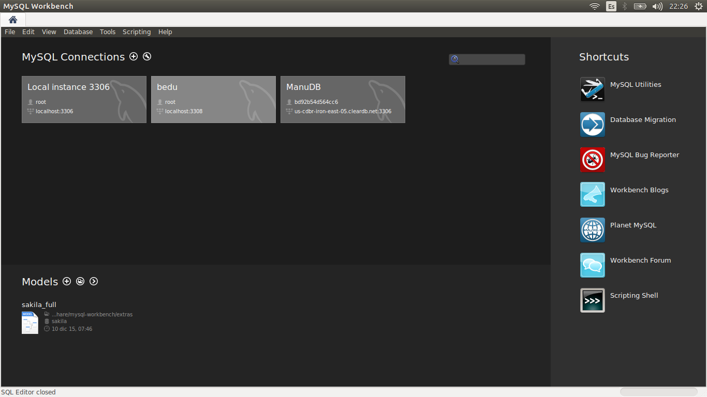
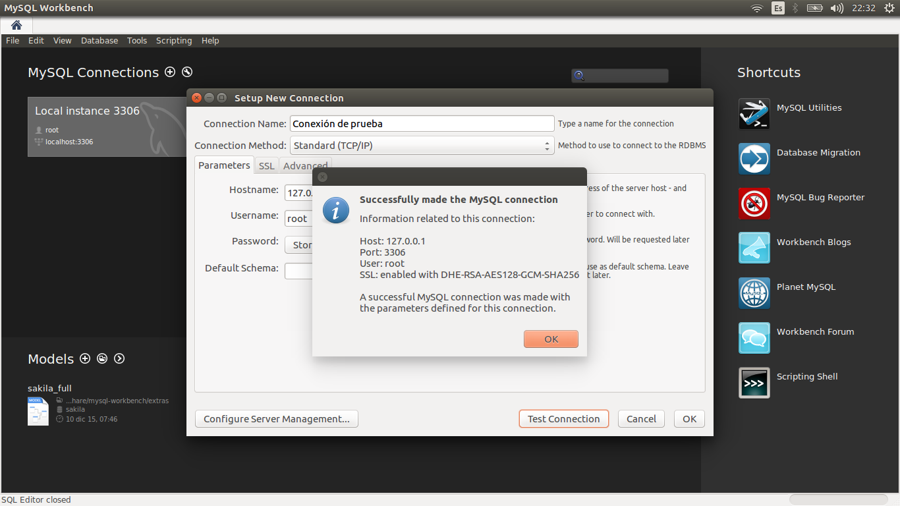
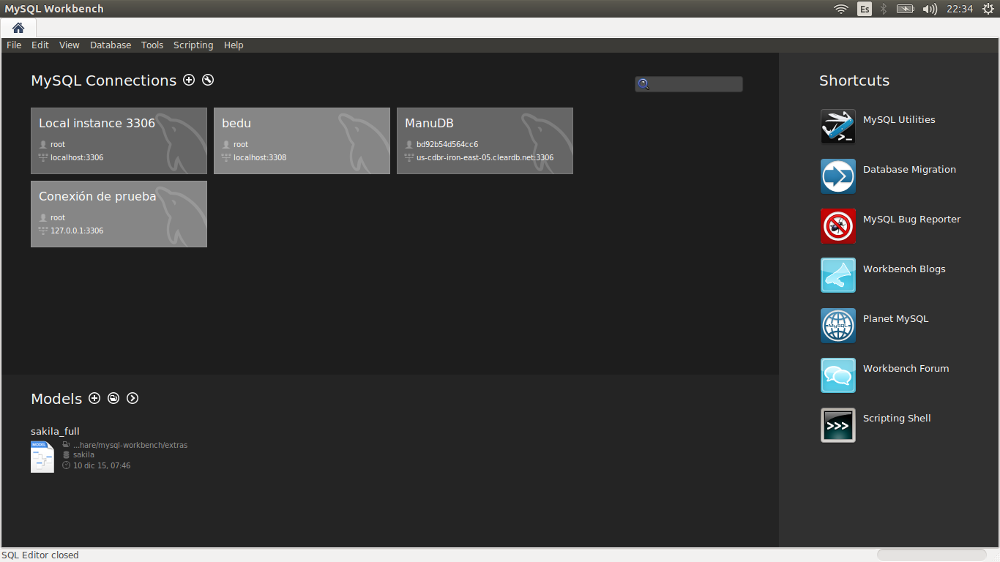
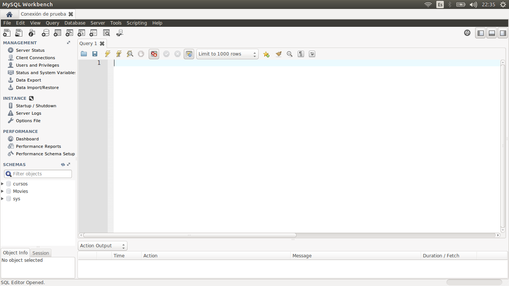

[`Introducción a Bases de Datos`](../../Readme.md) > [`Sesión 01`](../Readme.md) > `Ejemplo 01`

## Ejemplo 1: Conexión a bases de datos

### OBJETIVO

- Aprender a realizar la conexión a una base de datos mediante un cliente.

#### REQUISITOS

1. MySQL Workbench instalado.

#### DESARROLLO

1. Abre MySQL Wokbench. En esta primera pantalla se muestran las conexiones que tienes configuradas o se muestra en blanco en caso de que sea la primera vez que realizas una conexión.

   

2. Junto al título `MySQL Connections` da clic en el botón de más. Se abrirá una nueva ventana solicitando los datos para realizar la conexión correspondiente. Introduce los datos necesarios para realizar la conexión. Pide al experto que te los proporcione.

   - **Connection Name:** Un nombre de tu preferencia para recordar a qué servidor te estás conectando.
   - **Hostname:** Dirección del servidor al cuál nos conectaremos.
   - **Port:** Puerto a través del cual realizaremos la conexión.
   - **Password:** Contraseña de acceso. Da clic en el botón `Store in Keychain ...` e introduce la contraseña.
   
   

3. Presiona el botón `Test Connection` y si obtienes un mensaje como el que se muestra en la siguiente imagen, entonces los datos de la conexión son correctos y presiona el botón `Ok`. En caso contrario revisa las credenciales.

   

4. Se añadirá la conexión que acabas de configurar a la pantalla inicial.

   

5. Da clic sobre la conexión que se agregó a la pantalla inicial, se mostrará una ventana como la de la imagen.

   

**¡Felicidades! Haz realizado tu primera conexión a una base de datos**
