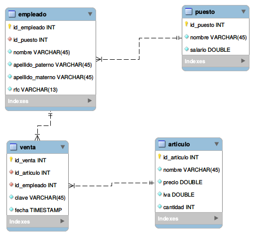

[`Introducción a Bases de Datos`](../../Readme.md) > [`Sesión 01`](../Readme.md) > `Postwork`

## Postwork Sesión 1

### 1. Objetivos :dart:

- Iniciar con el planteamiento del problema que resolverás a lo largo de todo el programa.

### 2. Requisitos :clipboard:

1. MySQL Workbench instalado.

### 3. Desarrollo :rocket:

#### Planteamiento del proyecto

A lo largo del programa deberás desarrollar un proyecto. En este postwork, debes definir con qué conjunto de datos vas a trabajar, si es un proyecto de datos propios o vas a seleccionar algún conjunto de datos público.  
Al mismo tiempo darás forma a la base de datos que usarás para almacenar datos y a partir de ahí obtener información relevante.  

Si haces uso de los datos públicos a continuación algunas sugerencias para buscar y descargar conjuntos de datos
   - https://datos.gob.mx
   - https://grouplens.org
   - https://www.kaggle.com
   - https://archive.ics.uci.edu/ml/datasets.php

Una vez que sepas con qué datos vas a trabajar, define cómo los usarás y qué problema vas a resolver. Ten esto muy en cuenta pues lo usaremos en la siguientes sesiones.

Te recomendamos plantear en un diagrama las bases de datos que vas a utilizar. Este tipo de diagramas se conocen como entidad-relación. Por ejemplo, para la base de datos de la tienda que manejamos en la clase, se tiene el siguiente diagrama entidad-relación.

Este diagrama puedes generarlo en MySQL Workbench. Si tienes dudas de cómo trabajarlo, pregunta al experto asignado.

Una vez definida la estructura de tu proyecto, define cinco preguntas que te interesen sobre la base de datos que definiste y escribe (a mano) las consultas equivalentes. Más adelante te apoyaremos en instalar tu propio servidor de bases de datos y podrás probar tus consultas.

[`Anterior`](../Proyecto/Readme.md) | [`Siguiente`](../../Sesion-02/Readme.md)

