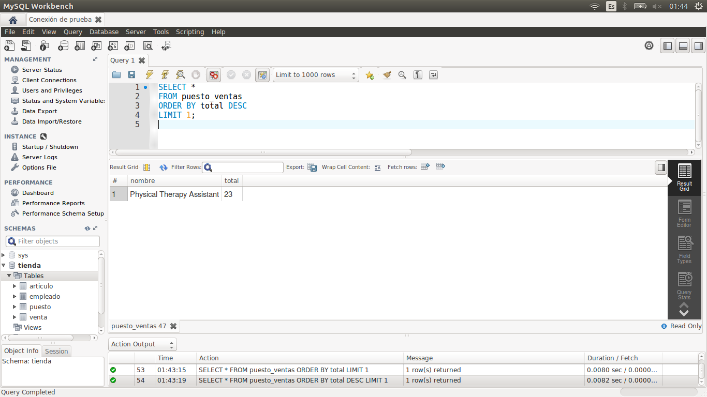

[`Introducción a Bases de Datos`](../../Readme.md) > [`Sesión 03`](../Readme.md) > `Reto 02`
	
## Definición de vistas

### OBJETIVOS

- Definir vistas sobre algunas consultas.

#### REQUISITOS 

1. MySQL Workbench instalado.

#### DESARROLLO

Usando la base de datos `tienda`, define las siguientes vistas que permitan obtener la siguiente información.

- Obtener el puesto de un empleado.
- Saber qué artículos ha vendido cada empleado.
- Saber qué puesto ha tenido más ventas.

<details><summary>Solución</summary>
<p>

- Obtener el puesto de un empleado.

   ```sql
   CREATE VIEW puestos AS
   SELECT concat(e.nombre, ' ', e.apellido_paterno), p.nombre
   FROM empleado e
   JOIN puesto p
     ON e.id_puesto = p.id_puesto;
   ```
   
   ```sql
   SELECT *
   FROM puestos;
   ```
   
   

- Saber qué artículos ha vendido cada empleado.

   ```sql
   CREATE VIEW empleado_articulo AS
   SELECT v.clave, concat(e.nombre, ' ', e.apellido_paterno) nombre, a.nombre articulo
   FROM venta v
   JOIN empleado e
     ON v.id_empleado = e.id_empleado
   JOIN articulo a
     ON v.id_articulo = a.id_articulo
   ORDER BY v.clave;
   ```
   
   ```sql
   SELECT *
   FROM  empleado_articulo;
   ```
   
   
   
- Saber qué puesto ha tenido más ventas.

   ```sql
   CREATE VIEW puesto_ventas AS
   SELECT p.nombre, count(v.clave) total
   FROM venta v
   JOIN empleado e
     ON v.id_empleado = e.id_empleado
   JOIN puesto p
     ON e.id_puesto = p.id_puesto
   GROUP BY p.nombre;
   ```
   
   ```sql
   SELECT *
   FROM puesto_ventas
   ORDER BY total DESC
   LIMIT 1;
   ```
   
    

</p>
</details> 
