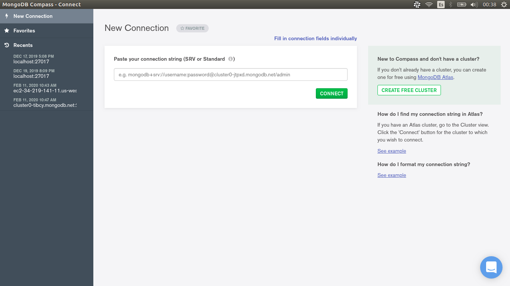
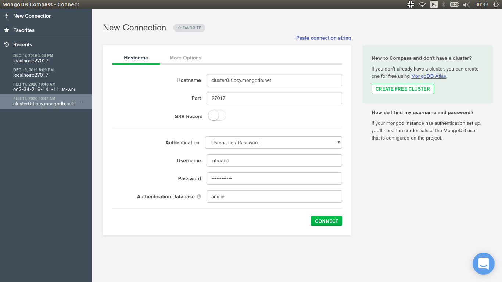
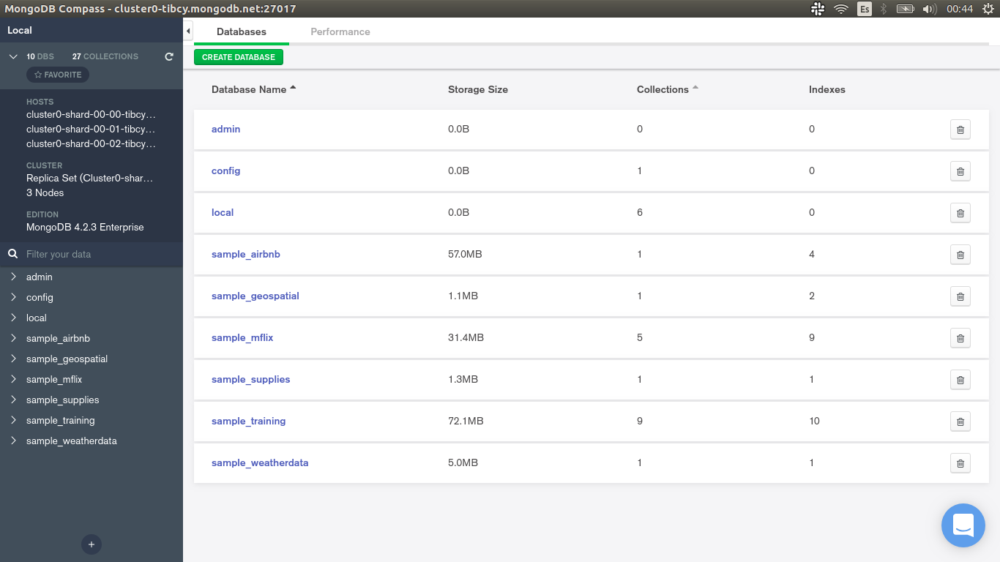

[`Introducción a Bases de Datos`](../../Readme.md) > [`Sesión 04`](../Readme.md) > `Ejemplo 1`

## Ejemplo 1: Conexión a MongoDB

### 1. Objetivos :dart:

- Realizar la conexión a MongoDB mediante el cliente MongoDB Compass.

### 2. Requisitos :clipboard:

1. MongoDB Compass instalado.

### 3. Desarrollo :rocket:

1. Abre MongoDB Compass. En esta primera pantalla se muestran, del lado izquierdo, las conexiones que tienes configuradas o se muestra en blanco en caso de que sea la primera vez que realizas una conexión.

   

2. Abajo del título `New Connection`, da clic en el texto que dice `Fill in connection fields individually`. Cambiará el formato de la pantalla. Introduce los datos necesarios para realizar la conexión. Pide al experto que te los proporcione.

   - **Hostname:** Dirección del servidor al cuál nos conectaremos.
   - **Port:** Puerto a través del cual realizaremos la conexión.
   - **SRV Record:** Dejar apagado.
   - **Authentication:** Username / Password.
   - **Username:** Nombre de usuario.
   - **Password:** Contraseña de acceso.
   - **Authentication Database:** Base de datos con la que se definió el usuario.
   
   

3. Presiona el botón `Connect` y y si obtienes una pantalla como la que se muestra en la siguiente imagen, la conexión se habrá realizado con éxito.

   

**¡Felicidades! Haz realizado tu primera conexión a una base de datos con MongoDB**

[`Anterior`](../Readme.md#conexión-a-mongodb) | [`Siguiente`](../Readme.md##colecciones-documentos-y-proyecciones)

