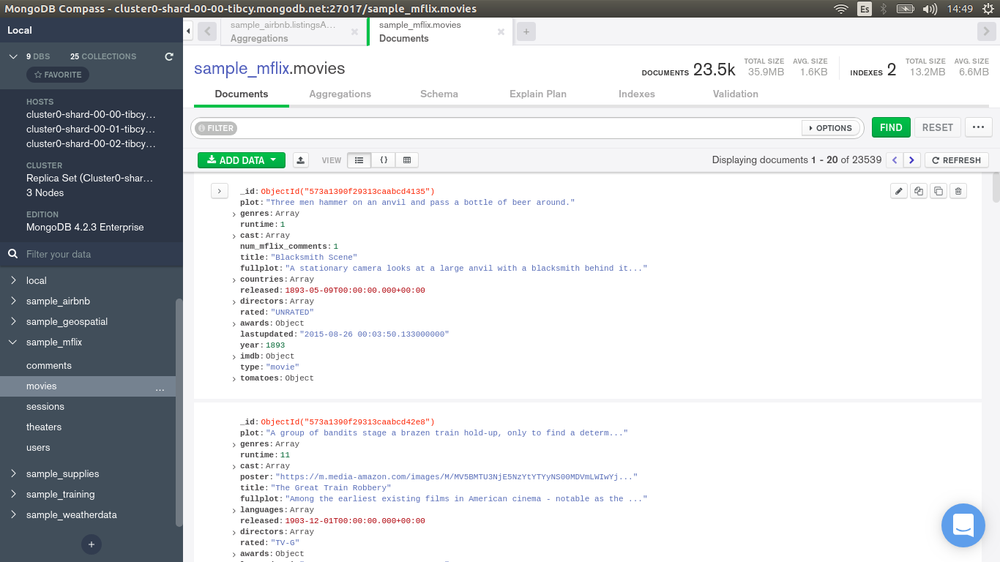
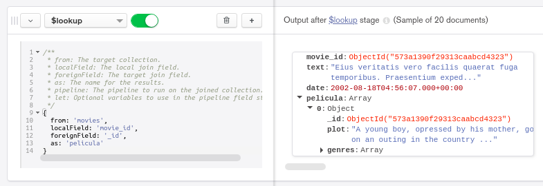
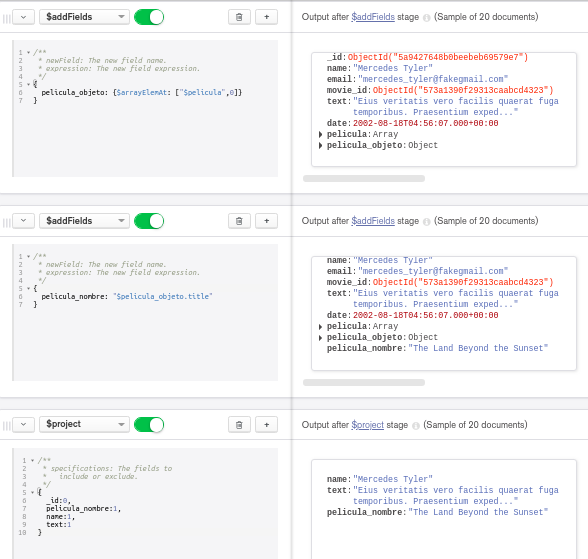

[`Introducción a Bases de Datos`](../../Readme.md) > [`Sesión 06`](../Readme.md) > `Ejemplo 02`

### Ejemplo 2: Asociación de colecciones

#### OBJETIVO

- Asociar colecciones mediante sus campos en común, usando la agregación `$lookup`.

#### REQUISITOS

1. MongoDB Compass instalado.

#### DESARROLLO

En la base de datos, existen varias colecciones que pueden asociarse. Por ejemplo la colección `comments` tiene la siguiente estructura:


Sin embargo, para conocer la película sobre la cual se hizo el comentario, es necesario consultar la colección `movies`. Y buscar el id que leímos de la colección `comments`.



Para facilitar esta búsqueda podemos usar una agregación `$lookup` que permite asociar dos colecciones. Algo similar a la operación `JOIN` de `SQL`.

Agregamos la agregación `$lookup` con el siguiente json:

```json
{
  from: 'movies',
  localField: 'movie_id',
  foreignField: '_id',
  as: 'pelicula'
}
```

Esto nos indica que la colección actual (`comments`) se asociará con la conexión `movies` que el campo que tomaremos para asociarlas será `comments.movie_id` y `movies._id` respectivamente y que los resultados serán almacenados en un arreglo llamado `pelicula`.



Elegimos únicamente los campos de interés, primero extrayendo el nombre del objeto que envuelve el arreglo y posteriormente proyectando únicamente los campos deseados

- `$addFields`

```json
{
  pelicula_objeto: {$arrayElemAt: ["$pelicula",0]}
}
```

- `$addFields`

```json
{
  pelicula_nombre: "$pelicula_objeto.title"
}
```

- `$project`

```
{
  _id:0,
  pelicula_nombre:1,
  name:1,
  text:1
}
```


